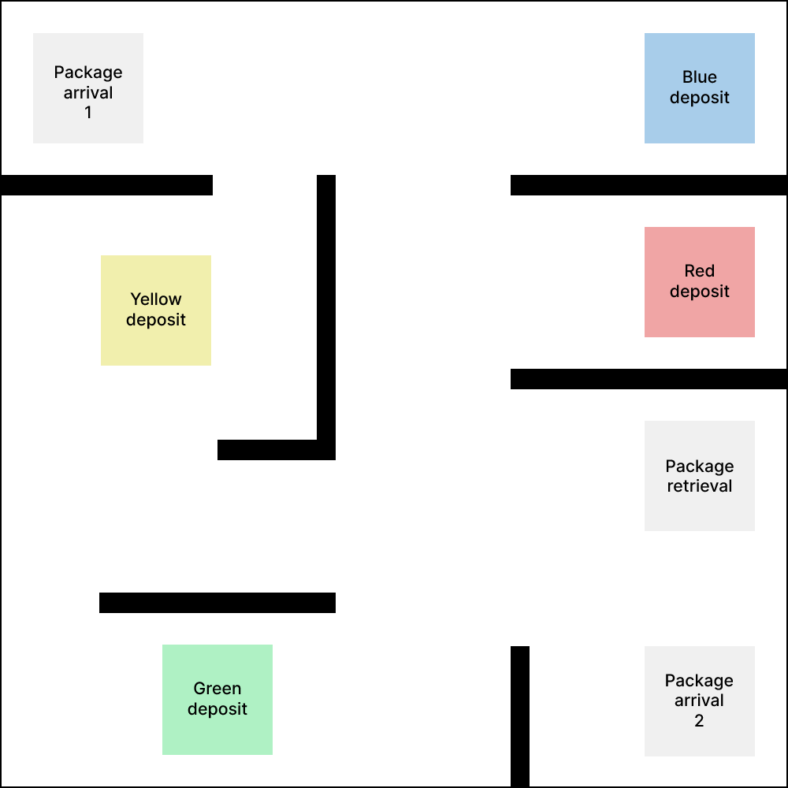
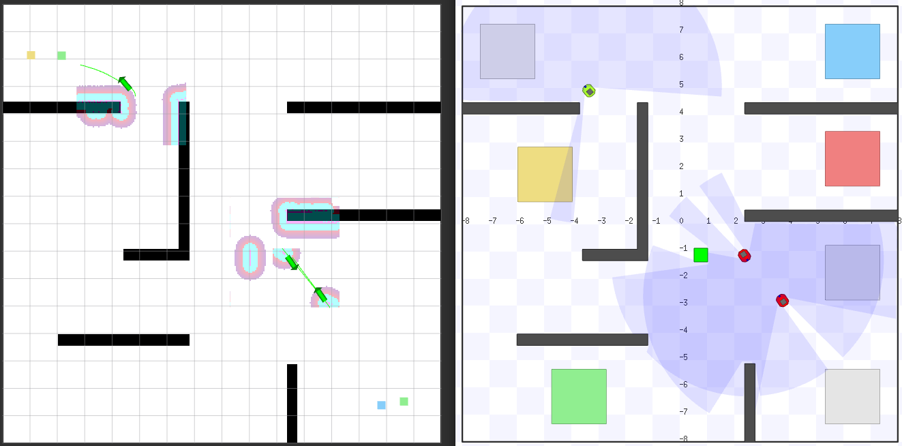
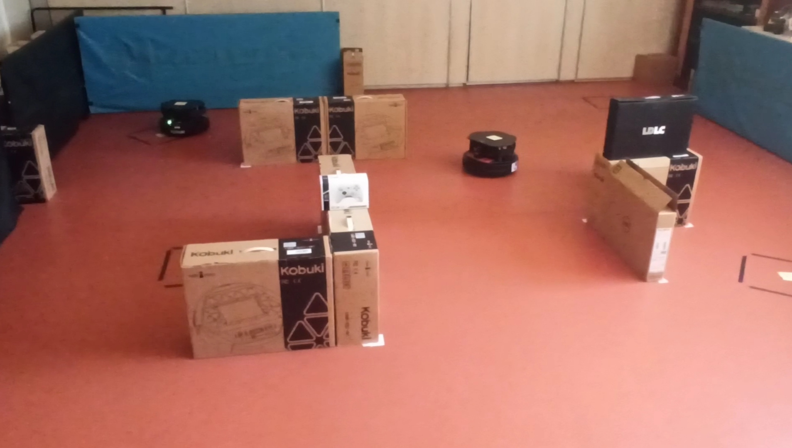

# pkg-multibot

This repository's goal is to study the **coordination of a robot fleet** using **ROS2** (Iron). We will study different communication methods and architectures to achieve a specific scenario, and compare them based on different criteria.

## Installation

To install all the dependencies, check [here](docs/installation.md).

## 1. Scenario

We want to be able to control an **heterogeneous fleet of robots** (for example robots from different vendors) in an 
industrial environment.

We will consider the following situation :  
In a warehouse, there are **2 arrivals of packages**. At random time intervals, packages arrive at each arrival zone.
Each package has a **specific color**, and for each color there is a corresponding **deposit zone** in the map.

We will consider 2 possible **tasks** for the robots :
- **Store :** Once a package arrives at a pickup spot, a robot will be selected to pick up the package, and carry it to the correct deposit zone, **depending on its color**.
- **Retrieve :** An operator can send a request to retrieve a package from a specific color. A robot will be selected to go to the correct storing position, and bring back a package to the **retrieval zone**

There will be 3 robots working together, **coordinating**, in order to achieve these tasks in the shortest time possible.

This coordination will be achieved thanks to an **auction/bid system**, that would assign the task to the best robot (based
on its position and its waypoints queue). This auction system could either be centralized, with an entity listening all
the bids and choosing the best one, or distributed, with each robot comparing its bid with the others.

First we'll consider that once a task is assigned to a robot, it can't abandon it and give it to another robot. However,
we could later add an **intermediate zone**, where robots would drop the package they are currently carrying to move to
another task, and another robot would be assigned that package, if that solution is globally better for the fleet.

As a bonus, it would be interesting to see how well the architecture is able to adapt to new robots dynamically added to the
fleet or robot failures.
Robot failures would be simulated by sending a message containing the robot ID on a global topic.

First, we'll consider that all the robots evolve in a known map. At the end, it would also be interesting to study how the
fleet could share information to create a common map with multi robot SLAM algorithms.

## 2. Communication methods

A list of communication methods are implemented in this repo, you can see them [here](docs/methods.md)

## 3. Demos

### Simulation

    
    
Demo with Rviz (on the left) and the stage simulator on the right

If you want to run the simulation demos, click [here](docs/simulation.md)

### Real robots

If you want to run the real robot demos, click [here](docs/real.md)

