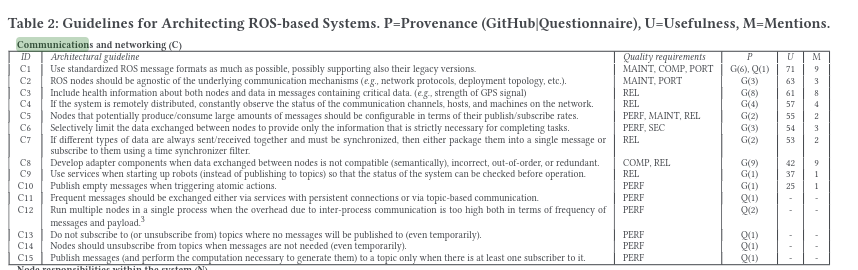

# pkg-multibot

This repository's goal is to study the **coordination of a robot fleet** using **ROS2**. We will study different communication methods and architectures to achieve a specific scenario, and compare them based on different criteria.

## Scenario

We want to be able to control an **heterogenous fleet of robots** (for example robots from different vendors).

First, we'll consider that all the robots evolve in a known map. The operator would be able to send a goal pose, and an auction/bid system would assign the task to only one of the robots (based on its position and its waypoints queue). This auction system could either be centralized, with an entity listening all the bids and choosing the best one, or distributed, with each robot comparing its bid with the others.

As a bonus, it would be interesting to see how well the architecture is able to adapt to new robots dynamically added to the fleet or robot failures.

At the end, it would also be interesting to study how the fleet could share information to create a common map with multi robot SLAM algorithms.

## Comparison criteria

To compare the different methods and architectures, we'll use different criteria :

- **Dynamism :** Does the architecture allow to dynamically add a robot to the fleet ? (dynamic identification...)
- **Resilience :** Does the architecture continue to work when there are failures (of the robots or the operator) ? 
- **Reliability :** Are there losses in the communication ?
- **Isolation :** Are robot specific informations shared or kept local ? How much control do we have over the information shared ?
- **Network usage :** How much data is transfered on the network ?
- **Scalability :** Does the system still work well when there are lots of robots ?
- **Computability :** Does the system require a lot of computing power (both on the robots and the operator) ?
- **Ease of simulation :** How easy is it to reproduce this communication architecture in a simulation ?
- **Ease of programming :** Does this architecture require the programmer to make a lot of configuration on each robot to allow them to communicate ?
- **Ease of debugging :** Is it simple to check for nodes / topics on a specific robot ?

## Communication methods

Here is the list of the different communication methods we will study :

### Working

- Namespacing
- Different domain IDs (centralized or distributed)
- DDS Discovery servers (centralized or distributed)

### Promising

- [DDS partitions](https://docs.ros.org/en/iron/Tutorials/Advanced/FastDDS-Configuration.html#using-partitions-within-the-topic) for each topic
- [Security](https://github.com/ros2/sros2/blob/master/SROS2_Windows.md) inside ROS2 to prevent communication if no certificate

### Ideas to check

- [DDS domain tag](https://community.rti.com/static/documentation/connext-dds/6.0.1/doc/manuals/connext_dds/html_files/RTI_ConnextDDS_CoreLibraries_UsersManual/Content/UsersManual/ChoosingDomainTag.htm) (only CycloneDDS) that drops messages from the same DOMAIN_ID if nodes don't have the same domain tag
    > Is it possible for a node to be on multiple `tag` at the same time / switch when publishing ?
- *Modifying to the DDS RMW implementations to get access to Publisher/Subscriber and modify partitions dynamically (see [this](https://discourse.ros.org/t/restricting-communication-between-robots/2931/31))*

### Others

- Custom communication outside of ROS2 :
    > MQTT, Lora, Zigbee, Zenoh, ad hoc multi-hop with babel protocol

- Hubs ?? (see [this][1])

## Comparing the communication methods

<table>
    <thead>
        <tr>
            <th id="hidden"></th>
            <th colspan="9" style="text-align:center">Criteria</th>
        </tr>
        <tr>
            <th>Method</th>
            <th>Dynamism</th>
            <th>Reliability</th>
            <th>Isolation</th>
            <th>Network Usage</th>
            <th>Computability</th>
            <th>Ease of simulation</th>
            <th>Ease of programming</th>
            <th>Ease of debugging</th>
        </tr>
    </thead>
    <tbody>
        <tr>
            <th>Namespaces</th>
            <td>❔</td>
            <td>✅</td>
            <td>❌</td>
            <td>❌</td>
            <td>✅</td>
            <td>✅</td>
            <td>✅</td>
            <td>✅</td>
        </tr>
        <tr>
            <th>Domain ID</th>
            <td>❔</td>
            <td>🟠</td>
            <td>✅</td>
            <td>✅</td>
            <td>🟠</td>
            <td>❌</td>
            <td>🟠</td>
            <td>🟠</td>
        </tr>
        <tr>
            <th>DDS Discovery server</th>
            <td>❔</td>
            <td>✅</td>
            <td>🟠</td>
            <td>✅</td>
            <td>🟠</td>
            <td>🟠</td>
            <td>🟠</td>
            <td>❌</td>
        </tr>
        <tr>
            <th>DDS Partitions</th>
            <td>❔</td>
            <td>✅</td>
            <td>✅</td>
            <td>✅</td>
            <td>✅</td>
            <td>❔</td>
            <td>🟠</td>
            <td>❌</td>
        </tr>
    <tbody>
</table>

> ***Legend :***  
> ✅ : Good / Easy  
> ❌ : Bad / Difficult  
> 🟠 : In between / Needs configuration to work  
> ❔ : Unknown for the moment  

### Other criteria

Here, we only compared the different communication methods, without taking into consideration the global architecture of the system.

The system can have a :
- **centralized architecture :** there is an entity, that centralizes the information and sends back information to all robots. That entity has running nodes and is on the common network between robots.
- **distributed architecture :** there is no central entity, each robot communicates informations to all other robots.
- **ad-hoc architecture :** there is no central entity, each robot communicates informations to its neighbours

A centralized architecture has the benefit of being pretty easy to design and implement in the code : each robot sends informations (sensors...), and the central computer gathers them to send back instructions to the robots.
However, if the central computer fails, all the communication is stopped and this causes the entire fleet to be down.

On the contrary, a distributed architecture is much more **resilient** to failure : as robots are all interconnected, if one fails, the others can still communicate. However, this is harder to design and implement, especially when robots have to take a decision together.

Finally, the two previous architectures assume that all robots are on a **common network**. However, when having lots of robots on the same network, we can experience bandwidth problems, which affects the effectiveness of the communication. The ad-hoc architecture can help with these issues, by enabling peer-to-peer (P2P) communication between robots, so that they can communicate locally with their neighbours. However, this prevents them from having a global organization, but rather local groups that communicate together. Furthermore, this is more costly, as every robot needs to have the equipment to be able to do such communication. 

<table>
    <thead>
        <tr>
            <th id="hidden"></th>
            <th colspan="6" style="text-align:center">Criteria</th>
        </tr>
        <tr>
            <th>Architecture</th>
            <th>Resilience</th>
            <th>Scalability</th>
            <th>Organization</th>
            <th>Cost</th>
            <th>Ease of programming</th>
        </tr>
    </thead>
    <tbody>
        <tr>
            <th>Centralized</th>
            <td>🟠</td>
            <td>❌</td>
            <td>✅</td>
            <td>✅</td>
            <td>✅</td>
        </tr>
        <tr>
            <th>Distributed</th>
            <td>✅</td>
            <td>❌</td>
            <td>✅</td>
            <td>✅</td>
            <td>🟠</td>
        </tr>
        <tr>
            <th>Ad-hoc</th>
            <td>✅</td>
            <td>✅</td>
            <td>🟠</td>
            <td>🟠</td>
            <td>❌</td>
        </tr>
    <tbody>
</table>

> **Note :** All of these issues (bandwidth, network range...) are pretty hard to simulate

## State of the art notes

### Network types
- Local : works ok but compromise between range and bandwidth/delay, especially with an important number of robots
- Cellular : works ok, even with lots of robots, but costly and less configurable
- Peer-to-peer : cools but still recent -> harder to find equipment
    - 4G LTE Device-to-Device (D2D) allows local communication
    - 5G Ultra-Reliable Low Latency Communications (URLLC), centralized or decentralized

### Simulators
- [MAES](https://link.springer.com/article/10.1007/s10015-023-00895-7) : multirobots simulator made with Unity, but maximum 5 robots via ROS2
- [Stage](https://github.com/tuw-robotics/stage_ros2/tree/humble)
- [Webots](https://cyberbotics.com/)
---
- *[LGSVL](https://github.com/lgsvl/simulator) for autonomous cars (not maintained anymore)*
- *Argos : simulator with ROS1 bridge but not ROS2*

### Libraries / Logiciels

- [awesome-ros2](https://github.com/fkromer/awesome-ros2) : repository full of links for libraries/docs/demo... for ROS2  
    > Useful liks :
    > - Benchmark : [ros2_benchmarking](https://github.com/piappl/ros2_benchmarking) or [performance_test](https://gitlab.com/ApexAI/performance_test/)
    > - Unity : [Robotics hub](https://github.com/Unity-Technologies/Unity-Robotics-Hub) or [ROS2 for Unity](https://github.com/RobotecAI/ros2-for-unity)
    > - [swarm example](https://github.com/Adlink-ROS/adlink_ddsbot)

- [ROS2swarm](https://github.com/ROS2swarm/ROS2swarm/) library

- [Ansible](https://docs.ansible.com/) to easily deploy software on multiple robots

## References

### ROS(2) specific

1. [A ROS2 based communication architecture for control in collaborative and intelligent automation systems][1]
    > Interesting isolation example but with ROS1/ROS2 bridges and hub ???

1. [Performance Improvement of Multi-Robot Data Transmission in Aggregated Robot Processing Architecture with Caches and QoS Balancing Optimization ](https://www.mdpi.com/2218-6581/12/3/87)
    > Nice global multi computer architecture (sensor drivers separated from calculus intensive activities)

1. [Robots that Sync and Swarm: A Proof of Concept in ROS 2](https://arxiv.org/pdf/1903.06440)
    > Ad-hoc wifi with babel protocol

1. 🔥 [How do you Architect your Robots? State of the Practice and Guidelines for ROS-based Systems](http://acme.able.cs.cmu.edu/pubs/uploads/pdf/ICSE_SEIP_20202020_ICSE_RobotArchitecture.pdf)
    > Robotics architecture standard with ROS (not ROS2) based on real examples
    > 

1. 🔥🔥🔥 [Restricting communication between robots](https://discourse.ros.org/t/restricting-communication-between-robots/2931)
1. 🔥🔥 [A more unified and standard way of configuring the DDS layer](https://discourse.ros.org/t/a-more-unified-and-standard-way-of-configuring-the-dds-layer/11372/18)

1. [Mapping and Optimizing Communication in ROS 2-based Applications on Configurable System-on-Chip Platforms](https://arxiv.org/pdf/2306.12761)
    > It's possible thanks to specific DDS libraries to run ROS2 on the GPU, FPGA... to increase performance

1. [Robot Operating System 2 (ROS2) - Based Frameworks for Increasing Robot Autonomy: A Survey](https://www.mdpi.com/2076-3417/13/23/12796)

### Up to date

1. [A Critical Review of Communications in Multi-robot Systems](https://link.springer.com/article/10.1007/s43154-022-00090-9)

### Old ones

1. [Current State of the Art in Distributed Autonomous Mobile Robotics](https://www.researchgate.net/profile/Lynne-Parker/publication/221230010_Current_State_of_the_Art_in_Distributed_Autnomous_Mobile_Robotics/links/0deec52b1bf084ef14000000/Current-State-of-the-Art-in-Distributed-Autnomous-Mobile-Robotics.pdf)

2. [Collective Grounded Representations for Robots](http://www.louis.hugues.xunuda.com/papers/dars.pdf)

3. [Grounded Symbolic Communication between Heterogeneous Cooperating Robots](https://www.researchgate.net/publication/2460805_Grounded_Symbolic_Communication_between_Heterogeneous_Cooperating_Robots)

4. [Distributed Sensing and Data Collection Via Broken Ad Hoc Wireless Connected Networks of Mobile Robots](https://www.researchgate.net/publication/221230049_Distributed_Sensing_and_Data_Collection_Via_Broken_Ad_Hoc_Wireless_Connected_Networks_of_Mobile_Robots)

5. [https://www.researchgate.net/publication/221230044_Communication_Fault_Tolerance_in_Distributed_Robotic_Systems](https://www.researchgate.net/publication/221230044_Communication_Fault_Tolerance_in_Distributed_Robotic_Systems)

[1]: https://www.researchgate.net/publication/339112401_A_ROS2_based_communication_architecture_for_control_in_collaborative_and_intelligent_automation_systems

