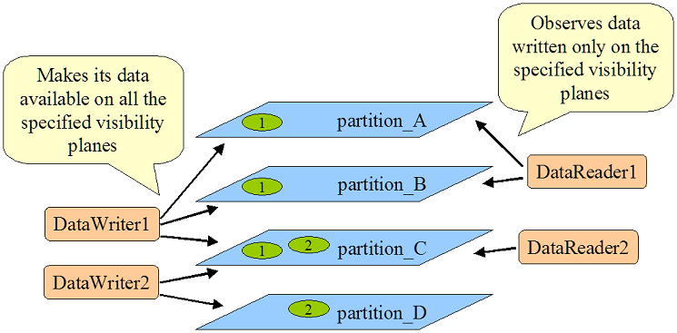

# pkg-multibot

This repository's goal is to study the **coordination of a robot fleet** using **ROS2**. We will study different communication methods and architectures to achieve a specific scenario, and compare them based on different criteria.

Although multi-robots research has been a subject for many years now (late 80s), there is still no standard on how to
architecture communication between them using ROS2. This readme's goal is to show the main communications methods that
exist, their advantages and drawbacks, so that you can choose the one that best fits your needs.

## Table of contents

1. [Scenario](#1-scenario)
1. [Comparison criteria](#2-comparison-criteria)
1. [Communication methods](#3-communication-methods)
    - [Namespacing](#namespacing)
    - [Different domain IDs](#different-domain-ids)
    - [DDS Discovery servers](#dds-discovery-servers)
    - [DDS Partitions](#dds-partitions)
1. [Comparing the communication methods](#4-comparing-the-communication-methods)
1. [Comparing the different architectures](#5-comparing-the-different-architectures)
1. [State of the art notes](#6-state-of-the-art-notes)
1. [References](#7-references)

## 1. Scenario

We want to be able to control an **heterogenous fleet of robots** (for example robots from different vendors).

First, we'll consider that all the robots evolve in a known map. The operator would be able to send a goal pose, and an
auction/bid system would assign the task to only one of the robots (based on its position and its waypoints queue). This
auction system could either be centralized, with an entity listening all the bids and choosing the best one, or distributed,
with each robot comparing its bid with the others.

As a bonus, it would be interesting to see how well the architecture is able to adapt to new robots dynamically added to the fleet or robot failures.

At the end, it would also be interesting to study how the fleet could share information to create a common map with multi robot SLAM algorithms.

## 2. Comparison criteria 

To compare the different methods and architectures, we'll use different criteria :

- **Dynamism :** Does the architecture allow to dynamically add a robot to the fleet ? (dynamic identification...)
- **Resilience :** Does the architecture continue to work when there are failures (of the robots or the operator) ? 
- **Reliability :** Are there losses in the communication ?
- **Isolation :** Are robot specific informations shared or kept local ? How much control do we have over the information shared ?
- **Network usage :** How much data is transfered on the network ?
- **Scalability :** Does the system still work well when there are lots of robots ?
- **Computability :** Does the system require a lot of computing power (both on the robots and the operator) ?
- **Ease of simulation :** How easy is it to reproduce this communication architecture in a simulation ?
- **Ease of programming :** Does this architecture require the programmer to make a lot of configuration on each robot to allow them to communicate ?
- **Ease of debugging :** Is it simple to check for nodes / topics on a specific robot ?

## 3. Communication methods

Here is the list of the different communication methods we will study :

- **Namespacing**
- **Different domain IDs**
- **DDS Discovery servers**
- **DDS Partitions**

### Namespacing
> See working demo [here](communication_test/README.md#robot-separation-using-namespaces)

**Namespaces** are prefixes to node names, topics, actions and services. They allow to have multiple elements with the same name but different prefix. 

In a multi-robot scenario, namespacing is the easiest solution to seperate each robot with a unique namespace, in order for robots
to not have name conflicts when running the same nodes and using the same topics. An example of this is to prefix the `cmd_vel`
topic for robots (`robot1/cmd_vel` and `robot2/cmd_vel`), to prevent them from having the same velocity command.

With our multi-robot architecture, we would have a configuration like the following :

### Different domain IDs
> See working demo [here](communication_test/README.md#multi-domain_id-communication)

ROS2 uses **DDS** (**D**ata **D**istribution **S**ervice) as the default middleware for communication. DDS allows nodes to 
discover other nodes that are on the same network. In order to create different logical networks, DDS provides a feature called 
the **domain ID**. Each node is allowed to communicate to nodes that are on the same ID, but can't communicate with nodes on other domain IDs.

In ROS2, the default domain ID is 0, but it can be configured using the `ROS_DOMAIN_ID` env variable (between 0 and 101 inclusive). The domain ID is then mapped to a UDP port, thus creating application isolation.

In a multi-robot scenario, assigning a different `ROS_DOMAIN_ID` to each robot allows to completely isolate them from the others. 
However, using the [domain_bridge](https://github.com/ros2/domain_bridge/blob/main/doc/design.md) library, we can create a bridge
between different domain IDs, and specify which topics should be broadcasted towards another domain ID (which would be shared between robots).

This library allows us to run multiple nodes in the same OS process, in order to share data and "bridge" topics/services/actions from one DOMAIN_ID to another one.

With our multi-robot architecture, we would have the following configuration :

### DDS Discovery servers
> See working demo [here](communication_test/README.md#network-isolation-with-fastdds-discovery-server)

As stated before, DDS is the protocol used by ROS2 for communicating between nodes. One aspect of this protocol is to look for
elements that a node can communicate with on the newtwork. It's the "Discovery protocol".

Fast DDS, one of the DDS middlewares, provides a [Discovery server](https://docs.ros.org/en/iron/Tutorials/Advanced/Discovery-Server/Discovery-Server.html), which works similarly to a router and allows to isolate DDS subnets.
Each node can choose which DDS Discovery servers (it can be more than 1) it connects to using the `ROS_DISCOVERY_SERVER` env variable.

> Listener 1 discovers topics from Talker 1 & 2 but Listener 2 only discovers topics from Talker 1

A discovery server is described by :
- its **IP address**
- its **port**
- its **ID**
> [!NOTE] 
> This solution is similar to the *"multi-master"* solution that existed in ROS1, as we're using ip addresses to connect
> multiple robots

In our multi-robot scenario, we could use this Discovery server to isolate nodes running on the robot, by connecting them to a DDS
Discovery server running locally. Nodes that also need to communicate to other robots would connect to both their local DDS server
and either a global one or another robot's one.

With our multi-robot architecture, we would have the following configuration :

### DDS partitions

As stated before, DDS is the protocol used by ROS2 for communicating between nodes. DDS introduced the concept of
[**partitions**](https://docs.ros.org/en/iron/Tutorials/Advanced/FastDDS-Configuration.html#using-partitions-within-the-topic) :
each partition is defined by a **string**, and only elements in the same partition can communicate. 

Contrary to the DOMAIN_ID, nodes still receive the broadcast discovery messages (since they are on the same DOMAIN_ID they have
the same UDP port) but drop them if they don't have a partition in common.

Partitions can be applied to specific nodes, but also more precisely **publishers/subscribers** *(DataReaders/DataWriters in DDS 
terms)*. To configure this, you can create an **XML file** and apply it by setting the `FASTRTPS_DEFAULT_PROFILES_FILE=/path/to/file.xml` env variable.

In our multi-robot scenario, we could have **one partition for each robot** (`robotX`). Topics that need to stay local would be 
published to that partition and topics that need to be shared across robots would be published in the `shared` partition.

With our multi-robot architecture, we would have the following configuration :

### Others to check

- DDSrouter (+ HusarnetVPN)

- [Security](https://github.com/ros2/sros2/blob/master/SROS2_Windows.md) inside ROS2 to prevent communication if the correct
certificate is not given

- [DDS domain tag](https://community.rti.com/static/documentation/connext-dds/6.0.1/doc/manuals/connext_dds/html_files/RTI_ConnextDDS_CoreLibraries_UsersManual/Content/UsersManual/ChoosingDomainTag.htm) (only CycloneDDS) that drops messages from the same DOMAIN_ID if nodes don't have the same domain tag
    > Is it possible for a node to be on multiple `tag` at the same time / switch when publishing ?

- Custom communication outside of ROS2 (but how to simulate) :
    > MQTT, Lora, Zigbee, Zenoh, ad hoc multi-hop with babel protocol

- Hubs ?? (see [this][1])

## 4. Comparing the communication methods

### Namespacing

- **Dynamism :** You can add robots but their namespace will not be set dynamically so you'll have to make sure yourself they are unique
- **Reliability :** No losses in the communication
- **Isolation :** Everything is shared to everyone in the network (other robots, the operator PC and any other PC)
- **Network usage :** At launch, every node tries to discover the nodes it can communicate with (Simple Discovery protocol) 
using a broadcast request. This creates a lot of network traffic. After that, only nodes that should communicate (publisher/
subscriber) will send packets to the network, thus not impacting the traffic.
- **Computability :** No additional nodes are needed for the communication
- **Ease of simulation :** Nothing special to configure
- **Ease of programming :** Just add the namespace to everything started by a launchfile (1 line)
- **Ease of debugging :** Easy, just use the basic tools of ROS2 (`ros2 node list`, `ros2 topic list`, `rqt_graph`, `rviz`...)

### Different domain IDs

- **Dynamism :** You can add robots but their `ROS_DOMAIN_ID` will not be set dynamically so you'll have to make sure yourself 
they are unique
- **Reliability :** The first message on a topic is caught by the bridge, and it creates the publisher in the other domain. 
However, sometimes the first message doesn't get sent back in the other domain ID, and is lost.
- **Isolation :** Only what is specified in the bridge configuration file is shared in the shared `ROS_DOMAIN_ID`. Every robot as
well as the operator can access that information.
- **Network usage :** At launch, every node tries to discover the nodes it can communicate with (Simple Discovery protocol) 
using a broadcast request. Since the robots are fully isolated, the network traffic will be reduced. After that, only nodes that 
should communicate (publisher/subscriber) will send packets to the network, thus not impacting the traffic.
informations.
- **Computability :** Additional nodes are needed, to be able to bridge the informations from one domain ID to the other (2 nodes 
in a shared process per robot for the moment)
- **Ease of simulation :** By default, Gazebo (or any other simulator) runs in a specific `ROS_DOMAIN_ID`. That way, you can't 
have robots evolving in different domain IDs inside of Gazebo. You'll have to spawn them in the same domain ID, and then create 
bridges for the default topics (`scan`, `odom`...) to the corresponding domain ID.
- **Ease of programming :** Set the correct environment variable before starting the nodes in the launchfile (1 line) and start 
the bridges in the launchfile (with a specific configuration file)
- **Ease of debugging :** To see the nodes/topics running on a specific robot, you must first export the `ROS_DOMAIN_ID` 
environment variable to the robot ID. Then you can use the basic ROS2 debug tools (`ros2 node list`, `ros2 topic list`, 
`rqt_graph`, `rviz`...).

### DDS Discovery servers

- **Dynamism :** You can add robots dynamically as long as you know the IP address, port and ID of the shared DDS Discovery Server.
However, if you are in a distributed architecture, you'll need to know every other robots' ip.
- **Reliability :** No losses in the communication
- **Isolation :** Nodes connected only to the local DDS Discovery server will be isolated. However, nodes connected to both the 
local DDS Discovery server and the operator's (="public" nodes) will be able to communicate to the shared network. Every other 
public node from other robots as well as the operator can access that information. Finally, these public nodes messages to local 
nodes will also be visible on the shared network.
- **Network usage :** At launch, every node tries to discover the nodes it can communicate with (Simple Discovery protocol) 
using a broadcast request. Since the networks are isolated, the network traffic will be reduced (see [this](communication_test/scripts/README.md)).
After that, only nodes that should communicate (publisher/subscriber) will send packets to the network, thus not impacting the traffic.
- **Computability :** Each robot need to host their own DDS Discovery server. There is also one hosted for the shared communication.
- **Ease of simulation :** To check. Bridges might be necessary, or at least a specific XML configuration before launching Gazebo.
- **Ease of programming :** Set the `ROS_DISCOVERY_SERVER` environment variable before starting the nodes in the launchfile 
(depending on whether they can communicate with the shared network or not).
Creating the `ROS_DISCOVERY_SERVER` environment variable takes multiple lines and is not easily readable since the IP address 
needs to be in the correct place in the list, based on the server ID *(example : `;;10.89.5.110:11811` for a server with ID=2)*
- **Ease of debugging :** By default, your ROS2 CLI will not have access to any information, even if the `ROS_DISCOVERY_SERVER` is 
correctly set. For it to work with the DDS Discovery server architecture, we need to configure ROS2 as a **"Super client"** (so 
that it discovers everything on the network). This can be done with an XML configuration file specifying the IP addresses, ports 
and IDs of the DDS Discovery servers you want to connect to.

> [!NOTE]
> It might be possible to change the ROS_DISCOVERY_SERVER env variable at runtime
> (see [this](https://readthedocs.org/projects/eprosima-fast-rtps/downloads/pdf/latest/#paragraph*.600))  
> This woud allow the operator nodes to only send messages to specific robots if needed

### DDS partitions

- **Dynamism :** You can add robots and their local partition can be their IP address because they are unique
- **Reliability :** No losses in the communication
- **Isolation :** Only what is specified in the bridge configuration file is shared to the corresponding partitions. You can 
choose to send some topics only to the operator PC and some only to other robots.
- **Network usage :** To check.
- **Computability :** No additional nodes are needed for the communication
- **Ease of simulation :** To check. Bridges might be necessary, or at least a specific XML configuration before launching Gazebo.
- **Ease of programming :** Create a specific configuration file (XML) and set it as an environment variable before starting the 
nodes in the launchfile (1 line).
- **Ease of debugging :** To check. An XML configuration file might be needed (the basic one would be to listen/publish to
the `{"","*"}` partitions)

> [!NOTE]
> In theory, DDS partitions can be changed dynamically at runtime
> (see [this](https://readthedocs.org/projects/eprosima-fast-rtps/downloads/pdf/latest/#subsubsection*.434)).
> This would allow the operator nodes to only send messages to specific robots if needed and also set their local partition
> dynamically by talking to the operator to get a unique ID.  
> However, ROS2 abstracts some of the configuration, and we can't do it anymore.
> You could maybe modify the DDS RMW implementations to get access to Publisher/Subscriber and modify partitions dynamically
> (see [this](https://discourse.ros.org/t/restricting-communication-between-robots/2931/31)) but it seems overcomplicated

### Results

Here are the results, based on the above explanations for each method.

<table style="margin-top:5px;">
    <thead>
        <tr style="border:none;">
            <th style="border: none;"></th>
            <th colspan="9" style="text-align:center">Criteria</th>
        </tr>
        <tr>
            <th>Method</th>
            <th>Dynamism</th>
            <th>Reliability</th>
            <th>Isolation</th>
            <th>Network Usage</th>
            <th>Computability</th>
            <th>Ease of simulation</th>
            <th>Ease of programming</th>
            <th>Ease of debugging</th>
        </tr>
    </thead>
    <tbody>
        <tr>
            <th>Namespaces</th>
            <td>🟠</td>
            <td>✅</td>
            <td>❌</td>
            <td>🟠</td>
            <td>✅</td>
            <td>✅</td>
            <td>✅</td>
            <td>✅</td>
        </tr>
        <tr>
            <th>Domain ID</th>
            <td>🟠</td>
            <td>🟨</td>
            <td>✅</td>
            <td>✅</td>
            <td>🟠</td>
            <td>❌❔</td>
            <td>🟠</td>
            <td>🟨</td>
        </tr>
        <tr>
            <th>DDS Discovery server</th>
            <td>🟨</td>
            <td>✅</td>
            <td>🟨</td>
            <td>✅</td>
            <td>🟨</td>
            <td>🟠❔</td>
            <td>🟠</td>
            <td>❌</td>
        </tr>
        <tr>
            <th>DDS Partitions</th>
            <td>🟨</td>
            <td>✅</td>
            <td>✅</td>
            <td>🟨❔</td>
            <td>✅</td>
            <td>🟠❔</td>
            <td>🟠</td>
            <td>🟠❔</td>
        </tr>
    <tbody>
</table>

> ***Legend :***  
> ✅ : Good / Easy  
> 🟨 : Fair  
> 🟠 : Poor / Needs configuration to work  
> ❌ : Bad / Difficult  
> ❔ : Unknown for the moment  

## 5. Comparing the different architectures

Above, we only compared the different technical communication methods using ROS2, without taking into consideration the global 
architecture of the system.

The system can have a :
- **centralized architecture :** there is an entity, that centralizes the information and sends back information to all robots. 
That entity has running nodes and is on the common network between robots.
- **distributed architecture :** there is no central entity, each robot communicates informations to all other robots.
- **ad-hoc architecture :** there is no central entity, each robot communicates informations to its neighbours

> The names of these architectures might be different in the litterature

> [!NOTE]
> Any of the previous communication methods can be adapted to work with these architectures

### Pros and cons

A **centralized architecture** has the benefit of being pretty easy to design and implement in the code : each robot sends 
informations (sensors...), and the **central computer** gathers them to send back instructions to the robots.
However, if the central computer fails, all the communication is stopped and this causes the entire fleet to be down.

On the contrary, a **distributed architecture** is much more **resilient** to failure : as **robots are all interconnected**, if 
one fails, the others can still communicate. However, this is harder to design and implement, especially when robots have
to take a decision together. Finally, if the router that the robots are connected to dies, all communication is interrupted.

Finally, the two previous architectures assume that all robots are on a **common network**. However, when having lots of robots on 
the same network, we can experience bandwidth problems, which affects the effectiveness of the communication. The **ad-hoc 
architecture** can help with these issues, by enabling **peer-to-peer (P2P) communication** between robots, so that they can 
**communicate locally** with their neighbours. However, this prevents them from having a global organization, but rather local
groups that communicate together. Furthermore, this is more costly, as every robot needs to have the equipment to be able to
do such communication. 

### Results

<table>
    <thead>
        <tr style="border:none;">
            <th style="border: none;"></th>
            <th colspan="6" style="text-align:center">Criteria</th>
        </tr>
        <tr>
            <th>Architecture</th>
            <th>Resilience</th>
            <th>Scalability</th>
            <th>Organization</th>
            <th>Cost</th>
            <th>Ease of programming</th>
        </tr>
    </thead>
    <tbody>
        <tr>
            <th>Centralized</th>
            <td>🟠</td>
            <td>❌</td>
            <td>✅</td>
            <td>✅</td>
            <td>✅</td>
        </tr>
        <tr>
            <th>Distributed</th>
            <td>🟨</td>
            <td>❌</td>
            <td>✅</td>
            <td>🟨</td>
            <td>🟠</td>
        </tr>
        <tr>
            <th>Ad-hoc</th>
            <td>✅</td>
            <td>✅</td>
            <td>🟠</td>
            <td>🟠</td>
            <td>❌</td>
        </tr>
    <tbody>
</table>

> [!NOTE]
> All of these issues (bandwidth, network range...) are pretty hard to simulate

## 6. State of the art notes

### Network types
- Local : works ok but compromise between range and bandwidth/delay, especially with an important number of robots
- Cellular : works ok, even with lots of robots, but costly and less configurable
- Peer-to-peer : cools but still recent -> harder to find equipment
    - 4G LTE Device-to-Device (D2D) allows local communication
    - 5G Ultra-Reliable Low Latency Communications (URLLC), centralized or decentralized

### Simulators
- [MAES](https://link.springer.com/article/10.1007/s10015-023-00895-7) : multirobots simulator made with Unity, but maximum 5 robots via ROS2
- [Stage](https://github.com/tuw-robotics/stage_ros2/tree/humble)
- [Webots](https://cyberbotics.com/)
---
- *[LGSVL](https://github.com/lgsvl/simulator) for autonomous cars (not maintained anymore)*
- *Argos : simulator with ROS1 bridge but not ROS2*

### Libraries / Software

- [awesome-ros2](https://github.com/fkromer/awesome-ros2) : repository full of links for libraries/docs/demo... for ROS2  
    > Useful liks :
    > - Benchmark : [ros2_benchmarking](https://github.com/piappl/ros2_benchmarking) or [performance_test](https://gitlab.com/ApexAI/performance_test/)
    > - Unity : [Robotics hub](https://github.com/Unity-Technologies/Unity-Robotics-Hub) or [ROS2 for Unity](https://github.com/RobotecAI/ros2-for-unity)
    > - [swarm example](https://github.com/Adlink-ROS/adlink_ddsbot)

- [ROS2swarm](https://github.com/ROS2swarm/ROS2swarm/) library

- [Ansible](https://docs.ansible.com/) to easily deploy software on multiple robots

## 7. References

### ROS(2) specific

1. [A ROS2 based communication architecture for control in collaborative and intelligent automation systems][1]
    > Interesting isolation example but with ROS1/ROS2 bridges and hub ???

1. [Performance Improvement of Multi-Robot Data Transmission in Aggregated Robot Processing Architecture with Caches and QoS Balancing Optimization ](https://www.mdpi.com/2218-6581/12/3/87)
    > Nice global multi computer architecture (sensor drivers separated from calculus intensive activities)

1. [Robots that Sync and Swarm: A Proof of Concept in ROS 2](https://arxiv.org/pdf/1903.06440)
    > Ad-hoc wifi with babel protocol

1. 🔥 [How do you Architect your Robots? State of the Practice and Guidelines for ROS-based Systems](http://acme.able.cs.cmu.edu/pubs/uploads/pdf/ICSE_SEIP_20202020_ICSE_RobotArchitecture.pdf)
    > Robotics architecture standard with ROS (not ROS2) based on real examples
    > 

1. 🔥🔥🔥 [Restricting communication between robots](https://discourse.ros.org/t/restricting-communication-between-robots/2931)
1. 🔥🔥 [A more unified and standard way of configuring the DDS layer](https://discourse.ros.org/t/a-more-unified-and-standard-way-of-configuring-the-dds-layer/11372/18)

1. [Mapping and Optimizing Communication in ROS 2-based Applications on Configurable System-on-Chip Platforms](https://arxiv.org/pdf/2306.12761)
    > It's possible thanks to specific DDS libraries to run ROS2 on the GPU, FPGA... to increase performance

1. [Robot Operating System 2 (ROS2) - Based Frameworks for Increasing Robot Autonomy: A Survey](https://www.mdpi.com/2076-3417/13/23/12796)

### Up to date

1. [A Critical Review of Communications in Multi-robot Systems](https://link.springer.com/article/10.1007/s43154-022-00090-9)

### Old ones

1. [Current State of the Art in Distributed Autonomous Mobile Robotics](https://www.researchgate.net/profile/Lynne-Parker/publication/221230010_Current_State_of_the_Art_in_Distributed_Autnomous_Mobile_Robotics/links/0deec52b1bf084ef14000000/Current-State-of-the-Art-in-Distributed-Autnomous-Mobile-Robotics.pdf)

2. [Collective Grounded Representations for Robots](http://www.louis.hugues.xunuda.com/papers/dars.pdf)

3. [Grounded Symbolic Communication between Heterogeneous Cooperating Robots](https://www.researchgate.net/publication/2460805_Grounded_Symbolic_Communication_between_Heterogeneous_Cooperating_Robots)

4. [Distributed Sensing and Data Collection Via Broken Ad Hoc Wireless Connected Networks of Mobile Robots](https://www.researchgate.net/publication/221230049_Distributed_Sensing_and_Data_Collection_Via_Broken_Ad_Hoc_Wireless_Connected_Networks_of_Mobile_Robots)

5. [https://www.researchgate.net/publication/221230044_Communication_Fault_Tolerance_in_Distributed_Robotic_Systems](https://www.researchgate.net/publication/221230044_Communication_Fault_Tolerance_in_Distributed_Robotic_Systems)

[1]: https://www.researchgate.net/publication/339112401_A_ROS2_based_communication_architecture_for_control_in_collaborative_and_intelligent_automation_systems
