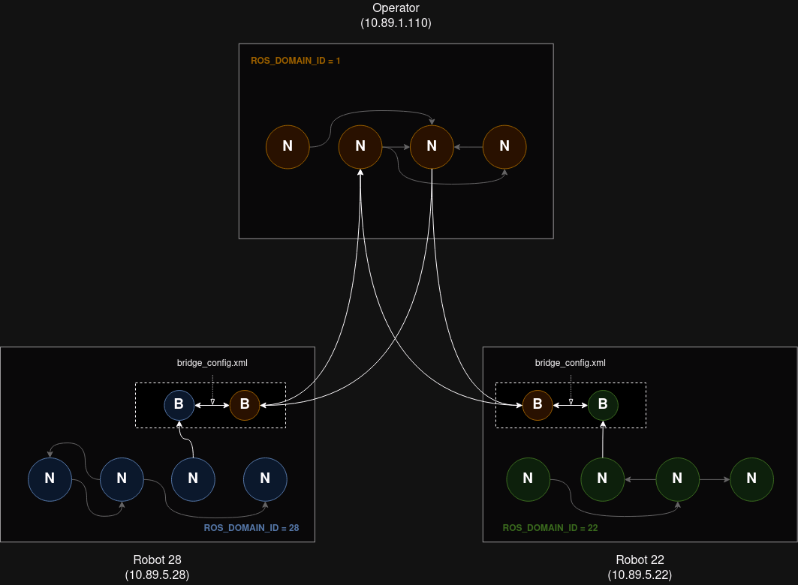
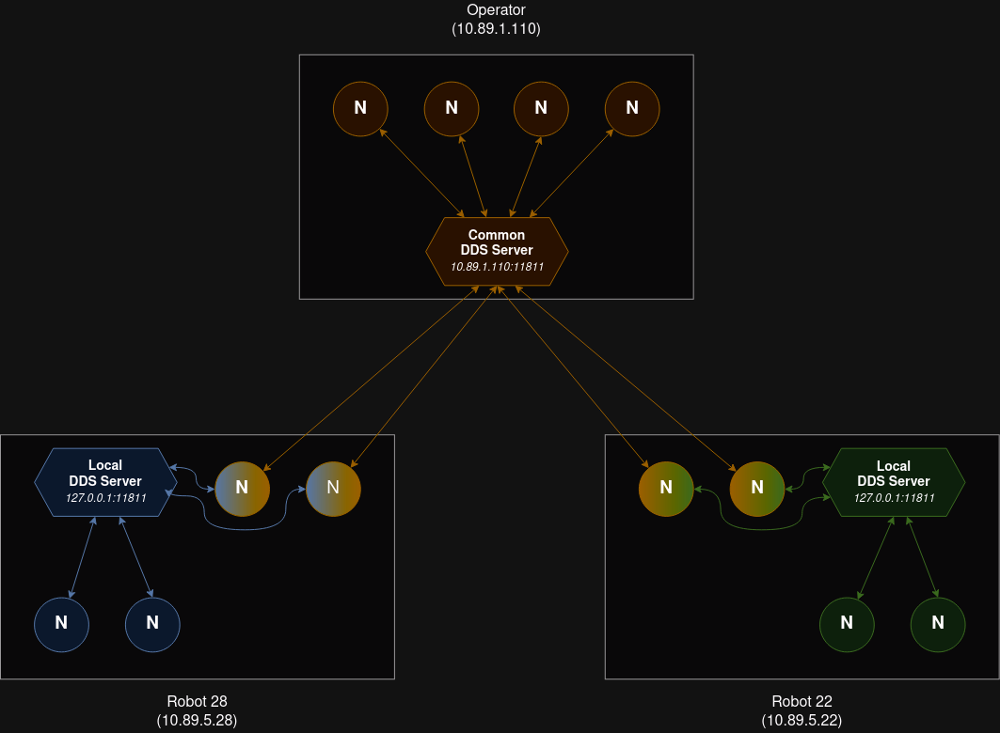

# Test communication entre plusieurs robots

## Communication multi DOMAIN_ID

On utilise la librairie [domain_bridge](https://github.com/ros2/domain_bridge/blob/main/doc/design.md) qui permet de lancer plusieurs noeuds dans un même processus et ainsi pouvoir "bridge" des topics d'un DOMAIN_ID vers un autre.

<div align="center"></div>

Pour l'installer : 
```bash
apt install ros-iron-domain-bridge
```

Sur notre architecture multi-robots, on obtiendrait la configuration suivante :
<div align="center"></div>


> **Remarque :** La librairie ne semble plus maintenue : [dernier commit](https://github.com/ros2/domain_bridge/commit/64e34de40218909b91057c368c10d4ce584af612) le 2 janvier 2023. Peut-être faudrait-il regarder [DDS Router](https://github.com/eProsima/DDS-Router) ou bien essayer de reproduire son fonctionnement au sein de nos noeuds de communication.


### Test simple avec un talker et listener

Il suffit de créer un fichier de configuration qui indique quels topics transmettre, de quel `ROS_DOMAIN_ID` et vers quel `ROS_DOMAIN_ID` *(cf [talker_bridge_config.yaml](./config/talker_bridge_config.yaml))*

Pour lancer le bridge, on utilise la commande suivante :

```bash
ros2 run domain_bridge domain_bridge <path_to>/bridge_config.yaml
```

> On peut lancer cette commande dans un terminal dont le `ROS_DOMAIN_ID` est quelconque

Dans un autre terminal, on lance le noeud `talker` :

```bash
ROS_DOMAIN_ID=2 ros2 run demo_nodes_py talker
```

Dans un autre terminal, on lance le noeud `listener` :

```bash
ROS_DOMAIN_ID=3 ros2 run demo_nodes_py listener
```


### Test avec plusieurs turtlesim

Chaque "robot" sera associé à un domain ID unique *(`bot_domain_id`)*. Dans chaque domain ID, on aura un `turtlesim_node` et un `turtlesim_controller` (qui permettra de déplacer la turtle vers les points).

Il suffira de lancer le launchfile suivant qui s'occupera de tout lancer (`turtle`, `operator` et `rviz`) :
```bash
ros2 launch communication_test turtlesim_bridge_launch.py
```
---

Si vous souhaitez cependant lancer tout cela à la main, voici les commandes :

Lancement des `turtle` dans des terminaux différents (les noeuds sont lancés automatiquement dans le bon `ROS_DOMAIN_ID` donné en argument du launchfile) :

```bash
ros2 launch communication_test turtlesim_bridge_robot_launch.py bot_domain_id:="10" operator_domain_id:="1"
ros2 launch communication_test turtlesim_bridge_robot_launch.py bot_domain_id:="11" operator_domain_id:="1"
```


Des noeuds de bridge sont lancés automatiquement par les launchfile pour transmettre les topics nécessaires aux noeuds dans l'`operator_domain_id`. On lancera donc le noeud opérateur (qui s'occupe de gérer la priorité entre les turtle) dans ce domaine :

```bash
ROS_DOMAIN_ID=1 ros2 run communication_test operator.py --ros-args -p nb_robots:=2
```

Lancement de rviz dans le `ROS_DOMAIN_ID` de l'opérateur :
```bash
ROS_DOMAIN_ID=1 ros2 launch communication_test rviz_launch.py
```

---

Pour envoyer des points à atteindre, on utilisera le bouton `2D Goal Pose` de Rviz ou bien la commande suivante :
```bash
ROS_DOMAIN_ID=1 ros2 topic pub /goal_pose geometry_msgs/msg/PoseStamped "{pose: {position: {x: 9, y: 9.0, z: 0.0}}}" --once
```

> Remarque : Au bout d'un certain temps, les noeuds "disparaissaient" : pas de crash, process qui tourne toujours, mais `ros2 node list` et `ros2 topic list` complétement vides. La seule solution qui a semblé marcher est de changer le DDS de **eProsima Fast DDS** vers **Eclipse Cyclone DDS**


## Partitionnement des réseaux avec FastDDS server

DDS est le protocole utilisé par ROS2 pour la communication entre les noeuds. Une partie de ce protocole consiste à chercher sur le réseau avec quels éléments un noeud est capable de communiquer, c'est le "discovery protocol".

Dans notre cas, on utilise un [Discovery server](https://docs.ros.org/en/iron/Tutorials/Advanced/Discovery-Server/Discovery-Server.html) du protocole Fast DDS, afin de simuler des "routeurs" et ainsi isoler des sous réseaux DDS. Exemple :

<div align="center"></div>


Sur notre architecture multi-robots, on obtiendrait la configuration suivante :
<div align="center"></div>


### Test simple avec un talker et listener

On lancera plusieurs serveurs DDS : 
- un pour isoler un réseau "local", dont le port est `11811`. Celui-ci représentera celui qui serait sur l'un des PC d'un robot.
- un pour le réseau commun à tous les robots, dont le port est `11812`. Celui-ci représentera celui qui serait sur le PC opérateur.

```bash
fastdds discovery -i 0 -l 127.0.0.1 -p 11811 # Local
fastdds discovery -i 1 -l 127.0.0.1 -p 11812 # Commun
```

---

**Test 1 :** On vérifie qu'un `talker` en local peut être écouté par un noeud en local et également un noeud en commun MAIS pas par un noeud de l'opérateur
```bash
# Simule un noeud local sur le robot
export ROS_DISCOVERY_SERVER="127.0.0.1:11811"
ros2 run demo_nodes_py talker
```
```bash
# Simule un noeud local sur le robot
export ROS_DISCOVERY_SERVER="127.0.0.1:11811"
ros2 run demo_nodes_py listener
```
```bash
# Simule un noeud subnet sur le robot
export ROS_DISCOVERY_SERVER="127.0.0.1:11811;127.0.0.1:11812"
ros2 run demo_nodes_py listener
```
```bash
# Simule un noeud de l'opérateur
export ROS_DISCOVERY_SERVER=";127.0.0.1:11812"
ros2 run demo_nodes_py listener
```

Les 2 premiers `listeners` devraient recevoir les messages publiés, mais pas le noeud "opérateur.

---

**Test 2 :** On vérifie qu'un `talker` dans le réseau commun peut être écouté par un noeud en local et également un noeud en commun
```bash
# Simule un noeud subnet sur le robot
export ROS_DISCOVERY_SERVER="127.0.0.1:11811;127.0.0.1:11812"
ros2 run demo_nodes_py talker
```
```bash
# Simule un noeud local sur le robot
export ROS_DISCOVERY_SERVER="127.0.0.1:11811"
ros2 run demo_nodes_py listener
```
```bash
# Simule un autre noeud subnet sur le robot
export ROS_DISCOVERY_SERVER="127.0.0.1:11811;127.0.0.1:11812"
ros2 run demo_nodes_py listener
```
```bash
# Simule un noeud de l'opérateur
export ROS_DISCOVERY_SERVER=";127.0.0.1:11812"
ros2 run demo_nodes_py listener
```

Les 3 listeners devraient recevoir les messages publiés.

---

> **Remarque :** Par défaut, ROS2 CLI créé un noeud pour découvrir le reste du réseau de noeuds. Pour que cela fonctionne, il faut que ROS2 soit configuré comme **"Super client"**.  
Cela se fait grâce au fichier de configuration [super_client_config.xml](./config/super_client_config.xml) et la commande suivante :
> ```bash
> export FASTRTPS_DEFAULT_PROFILES_FILE=path/to/super_client_config.xml
> ros2 daemon stop && ros2 daemon start # On redémarre le daemon pour s'assurer de la MAJ
> ```
> Attention cependant, vous aurez ainsi accès à tous les noeuds du graphe, **sans aucune partition du réseau**.
> Pour sélectionner les serveurs DDS auxquels vous souhaitez vous connecter, vous pouvez commenter les `<RemoteServer>` non concernés.
> Pour avoir accès uniquement au **réseau commun sur l'opérateur**, lancez les commandes suivantes :
> ```bash
> export FASTRTPS_DEFAULT_PROFILES_FILE=path/to/super_client_operator_config.xml
> ros2 daemon stop && ros2 daemon start # On redémarre le daemon pour s'assurer de la MAJ
> ```


### Test avec plusieurs turtlesim sur une même machine


Chaque "robot" hébergera un serveur DDS "local" permettant la communication de ses noeuds internes. Les noeuds nécessitant de communiquer avec l'extérieur (autres robots/opérateur) se connecteront en plus au serveur DDS de l'opérateur.

Il suffira de lancer le launchfile suivant qui s'occupera de tout lancer (`turtle`, `operator` et `rviz`) :
```bash
ros2 launch communication_test turtlesim_dds_launch.py
```
---

Si vous souhaitez cependant lancer tout cela à la main, voici la les commandes :

Lancement des serveurs DDS :
```bash
fastdds discovery -i 0 -l 127.0.0.1 -p 11811 # Serveur DDS local du robot 1
fastdds discovery -i 1 -l 127.0.0.1 -p 11812 # Serveur DDS local du robot 2
fastdds discovery -i 2 -l 127.0.0.1 -p 11813 # Serveur DDS local du robot 3
fastdds discovery -i 3 -l 127.0.0.1 -p 11814 # Serveur DDS commun à tous, sur l'opérateur
```

> **Remarque :** Ici on utilise des ports différents pour simuler les machines différentes. En pratique, chaque robot n'hébergera qu'un seul serveur DDS local, et le dernier (commun) sera sur l'opérateur.

Lancement des `turtle` (`turtlesim` et `turtle_controller`) dans des terminaux différents (les noeuds sont lancés automatiquement en se connectant aux bons serveurs DDS) :

```bash
ros2 launch communication_test turtlesim_dds_robot_launch.py local_dds_server:="127.0.0.1:11811" subnet_dds_server:="127.0.0.1:11814" nb_robots:="3" robot_id:="1"
ros2 launch communication_test turtlesim_dds_robot_launch.py local_dds_server:="127.0.0.1:11812" subnet_dds_server:="127.0.0.1:11814" nb_robots:="3" robot_id:="2"
ros2 launch communication_test turtlesim_dds_robot_launch.py local_dds_server:="127.0.0.1:11813" subnet_dds_server:="127.0.0.1:11814" nb_robots:="3" robot_id:="3"
```

Lancement du noeud opérateur :
```bash
export ROS_DISCOVERY_SERVER=";;;127.0.0.1:11814"
ros2 run communication_test operator.py --ros-args -p nb_robots:=3
```

Lancement de rviz :
```bash
export ROS_DISCOVERY_SERVER=";;;127.0.0.1:11814"
ros2 launch communication_test rviz_launch.py
```

---

Pour envoyer des points à atteindre, on utilisera le bouton `2D Goal Pose` de Rviz ou bien la commande suivante :
```bash
ros2 topic pub /goal_pose geometry_msgs/msg/PoseStamped "{pose: {position: {x: 9, y: 9.0, z: 0.0}}}" --once
```

### Test avec plusieurs turtlesim sur des machines différentes *(pibot)*

Sur chaque *pibot* on installe turtlesim :
```bash
sudo apt install ros-iron-turtlesim
```

On les mettra tous sur le `ROS_DOMAIN_ID=99`. On donnera une IP statique au PC opérateur (ici *`10.89.5.90`*).

Sur le PC opérateur :
```bash
ros2 launch communication_test pibot_dds_operator.py nb_robots:="2" common_dds_ip:="10.89.5.90" common_dds_port:="11811"
```

Sur chaque *pibot* :
```bash
ros2 launch communication_test pibot_turtlesim_dds_launch.py nb_robots:=2 operator_server:="10.89.5.90:11811"
```


## Séparation des robots avec namespaces

Les namespaces permettent d'ajouter un prefix à tous les noeuds, topics, services... d'un launchfile. Ils permettent ainsi d'éviter les collisions de données entre les données de robots différents.

Il suffira de lancer le launchfile suivant qui s'occupera de tout lancer (`turtle`, `operator` et `rviz`) :
```bash
ros2 launch communication_test turtlesim_namespace_launch.py
```