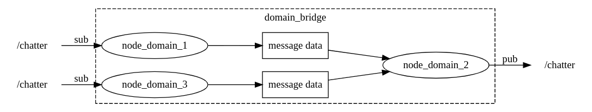

# Implementation demo of multi robot communication with ROS2

This package is a ROS2 package that implements the different solutions explained in the repository's root README.


## Robot separation using namespaces

Namespacing allow to add a prefix before every node, topic, service... in a launchfile. That way, they allow to avoid conflicts between data from different robots.

To start the demo, you can use the following command, that will take care of starting everything (`turtle`, `operator` et `rviz`) :
```bash
ros2 launch communication_test turtlesim_namespace_launch.py nb_robots:="3"
```


## Multi DOMAIN_ID communication

We will be using the [domain_bridge](https://github.com/ros2/domain_bridge/blob/main/doc/design.md) library that allows us to run multiple nodes in the same OS process, in order to "bridge" topics/services/actions from one DOMAIN_ID to another one.

<div align="center"></div>

To install it : 
```bash
apt install ros-iron-domain-bridge
```

> **Note :** The library doesn't seem to be maintained any more : [last commit](https://github.com/ros2/domain_bridge/commit/64e34de40218909b91057c368c10d4ce584af612) on January 2nd 2023. Maybe have a look at [DDS Router](https://github.com/eProsima/DDS-Router) or try to reproduce how it works inside our own communication nodes.


### Simple test with a talker and a listener

We only need to create a configuration file, telling the library which topics/services/actions need to be transmitted, from which `ROS_DOMAIN_ID` and to which `ROS_DOMAIN_ID` *(see [talker_bridge_config.yaml](./config/domain_bridge/talker_bridge_config.yaml))*
To start the bridge, we use the following command :

```bash
ros2 run domain_bridge domain_bridge <path_to>/bridge_config.yaml
```

> We can run this command from any terminal, regardless of the `ROS_DOMAIN_ID`

In another terminal, start the `talker` node :

```bash
ROS_DOMAIN_ID=2 ros2 run demo_nodes_cpp talker
```

In another terminal, start the `listener` node :

```bash
ROS_DOMAIN_ID=3 ros2 run demo_nodes_cpp listener
```


### Test with multiple turtlesim on the same computer

Each "robot" will be linked to a unique domain ID *(`bot_domain_id`)*. In each domain ID, there will be a `turtlesim_node` and a `turtlesim_controller` (which will control the movement of the turtle towards the goal poses).

To start the demo, you can use the following command, that will take care of starting everything (`turtle`, `operator` et `rviz`) :
```bash
ros2 launch communication_test turtlesim_bridge_launch.py nb_robots:="3"
```
---

However, if you want to manually start the nodes yourself, here are the commands :

Starting the `turtle` in different terminals (nodes will be started with the correct `ROS_DOMAIN_ID` given as an argument):

```bash
ros2 launch communication_test turtlesim_bridge_robot_launch.py bot_domain_id:="10" operator_domain_id:="1"
ros2 launch communication_test turtlesim_bridge_robot_launch.py bot_domain_id:="11" operator_domain_id:="1"
```

Bridge nodes will be started by the launchfiles to transmit the topics needed by nodes running in the `operator_domain_id`. Then, we'll start the operator node (which is responsible for managing priority between turtles) in this domain :

```bash
ROS_DOMAIN_ID=1 ros2 run communication_test static_operator.py --ros-args -p nb_robots:=2
```

Running `rviz` in the operator's `ROS_DOMAIN_ID` :
```bash
ROS_DOMAIN_ID=1 ros2 launch communication_test rviz_launch.py
```

---
In order to send goal points for the turtles to go to, you can press the `2D Goal Pose` in Rviz or run the following command :
```bash
ROS_DOMAIN_ID=1 ros2 topic pub /goal_pose geometry_msgs/msg/PoseStamped "{pose: {position: {x: 9, y: 9.0, z: 0.0}}}" --once
```

> Note : After some time, nodes were "disappearing" : they had not crashed, the processes were still running, but `ros2 node list` and `ros2 topic list` returned empty lists. The only solution that seemed to fix it was to change the DDS provider from **eProsima Fast DDS** to **Eclipse Cyclone DDS**


## Network isolation with FastDDS Discovery server

DDS is the protocol used by ROS2 for communicating between nodes. One aspect of this protocol is to look for elements that a node can communicate with on the newtwork. It's the "Discovery protocol".

In our use case, we'll use Fast DDS [Discovery server](https://docs.ros.org/en/iron/Tutorials/Advanced/Discovery-Server/Discovery-Server.html), which works similarly to a router and allows to isolate DDS subnets.


### Simple test with a talker and a listener

We are going to start multiple DDS Discovery servers :
- one to isolate a "local" network, which port is `11811`. This one will emulate one that would be on a robot computer.
- one on the common network between robots, which port is `11812`. This one will emulate one that would be on the operator computer.

```bash
fastdds discovery -i 0 -l 127.0.0.1 -p 11811 # Local
fastdds discovery -i 1 -l 127.0.0.1 -p 11812 # Commun
```

---


**Test 1 :** We check that a local `talker` node can be listened by a "local" node and a "common" node BUT not on a node on the operator
```bash
# Emulates a local node on the robot
export ROS_DISCOVERY_SERVER="127.0.0.1:11811"
ros2 run demo_nodes_cpp talker
```
```bash
# Emulates a local node on the robot
export ROS_DISCOVERY_SERVER="127.0.0.1:11811"
ros2 run demo_nodes_cpp listener
```
```bash
# Emulates a subnet node on the robot
export ROS_DISCOVERY_SERVER="127.0.0.1:11811;127.0.0.1:11812"
ros2 run demo_nodes_cpp listener
```
```bash
# # Emulates a node on the operator
export ROS_DISCOVERY_SERVER=";127.0.0.1:11812"
ros2 run demo_nodes_cpp listener
```

The first 2 `listeners` should receive the published messages, but not the "operator" node.

---

**Test 2 :** We check that a `talker` in the common network can be listened by a local node and also another node in the common network
```bash
# Emulates a subnet node on the robot
export ROS_DISCOVERY_SERVER="127.0.0.1:11811;127.0.0.1:11812"
ros2 run demo_nodes_cpp talker
```
```bash
# Emulates a local node on the robot
export ROS_DISCOVERY_SERVER="127.0.0.1:11811"
ros2 run demo_nodes_cpp listener
```
```bash
# Emulates another subnet node on the robot
export ROS_DISCOVERY_SERVER="127.0.0.1:11811;127.0.0.1:11812"
ros2 run demo_nodes_cpp listener
```
```bash
# Emulates a node on the operator
export ROS_DISCOVERY_SERVER=";127.0.0.1:11812"
ros2 run demo_nodes_cpp listener
```

All 3 listeners should receive the published messages.

---


> **Note :** By default, the ROS2 CLI creates a node in order to listen for other nodes/topics in the network. For this to work with the DDS Discovery server architecture, we need to configure ROS2 as a **"Super client"**.  
This can be done thanks to the [super_client_config.xml](./config/dds_server/super_client_config.xml) configuration file and the following command :
> ```bash
> export FASTRTPS_DEFAULT_PROFILES_FILE=path/to/super_client_config.xml
> ros2 daemon stop && ros2 daemon start # We restart the daemon to take the changes into account
> ```
> However, be careful because you will now have access to ALL nodes in the graph, **without any isolation of the network**.  
> In order to choose the discovery servers you want to connect to, you can comment the `<RemoteServer>` that don't interest you.  
> If you only want access to the **common network on the operator**, run the following commands :
> ```bash
> export FASTRTPS_DEFAULT_PROFILES_FILE=path/to/super_client_operator_config.xml
> ros2 daemon stop && ros2 daemon start # We restart the daemon to take the changes into account
> ```


### Test with multiple turtlesim on the same computer

Each robot will host its own "local" DDS Discovery server, allowing communication between its internal nodes. Nodes that need to communicate with the outside elements (other robots/operator) will also connect to the operator's DDS Discovery server.


To start the demo, you can use the following command, that will take care of starting everything (`turtle`, `operator` et `rviz`) :
```bash
ros2 launch communication_test turtlesim_dds_launch.py nb_robots:="3"
```

---

However, if you want to manually start the nodes yourself, here are the commands :

Starting the DDS Discovery servers :
```bash
fastdds discovery -i 0 -l 127.0.0.1 -p 11811 # Local DDS discovery server for robot 1
fastdds discovery -i 1 -l 127.0.0.1 -p 11812 # Local DDS discovery server for robot 1
fastdds discovery -i 2 -l 127.0.0.1 -p 11813 # Local DDS discovery server for robot 1
fastdds discovery -i 3 -l 127.0.0.1 -p 11814 # Common DDS discovery server, on the operator
```

> **Note :** Here, in this demo, we use different ports to emulate different machines. In reality, each robot will only host one local DDS Discovery server, and the last one will be hosted on the operator.


Starting the `turtle` (`turtlesim` et `turtle_controller`) in different terminals (nodes will be started connecting automatically to the correct DDS Discovery server(s)) :

```bash
ros2 launch communication_test turtlesim_dds_robot_launch.py local_dds_server:="127.0.0.1:11811" subnet_dds_server:="127.0.0.1:11814" nb_robots:="3" robot_id:="1"
ros2 launch communication_test turtlesim_dds_robot_launch.py local_dds_server:="127.0.0.1:11812" subnet_dds_server:="127.0.0.1:11814" nb_robots:="3" robot_id:="2"
ros2 launch communication_test turtlesim_dds_robot_launch.py local_dds_server:="127.0.0.1:11813" subnet_dds_server:="127.0.0.1:11814" nb_robots:="3" robot_id:="3"
```

Starting the operator node :
```bash
export ROS_DISCOVERY_SERVER=";;;127.0.0.1:11814"
ros2 run communication_test static_operator.py --ros-args -p nb_robots:=3
```

Starting rviz :
```bash
export ROS_DISCOVERY_SERVER=";;;127.0.0.1:11814"
ros2 launch communication_test rviz_launch.py
```

---

In order to send goal points for the turtles to go to, you can press the `2D Goal Pose` in Rviz or run the following command :
```bash
ros2 topic pub /goal_pose geometry_msgs/msg/PoseStamped "{pose: {position: {x: 9, y: 9.0, z: 0.0}}}" --once
```

### Test with multiple turtlesim on different computers *(pibot)*

First we need to install the `turtlesim` library on each *pibot* :
```bash
sudo apt install ros-iron-turtlesim
```

They will all be setup on `ROS_DOMAIN_ID=99`. The operator PC will have a static IP address (here it's *`10.89.5.90`*).

On the operator PC :
```bash
ros2 launch communication_test pibot_dds_operator.py nb_robots:="2" common_dds_ip:="10.89.5.90" common_dds_port:="11811"
```

On each *pibot* :
```bash
ros2 launch communication_test pibot_turtlesim_dds_launch.py nb_robots:=2 operator_server:="10.89.5.90:11811"
```


## Robot isolation using DDS partitions

DDS is the protocol used by ROS2 for communicating between nodes. DDS introduced a way to isolate DataWriters (Publishers)
and DataReaders (Subscribers) called [DDS partitions](https://fast-dds.docs.eprosima.com/en/latest/fastdds/dds_layer/domain/domainParticipant/partition.html#partitions)

For a Publisher to communicate with a Subscriber, they have to belong at least to one common partition.

### Simple test with a talker and a listener

In a first terminal, run a first talker (in the `chatter1` topic):
```bash
export RMW_IMPLEMENTATION=rmw_fastrtps_cpp
export RMW_FASTRTPS_USE_QOS_FROM_XML=1
export FASTRTPS_DEFAULT_PROFILES_FILE=path/to/talker_config.xml
ros2 run demo_nodes_cpp talker --ros-args -r chatter:=chatter1
```

In a second terminal, run a second talker (in the `chatter2` topic):
```bash
export RMW_IMPLEMENTATION=rmw_fastrtps_cpp
export RMW_FASTRTPS_USE_QOS_FROM_XML=1
export FASTRTPS_DEFAULT_PROFILES_FILE=path/to/talker_config.xml
ros2 run demo_nodes_cpp talker --ros-args -r chatter:=chatter2
```

In a third terminal, run a first listener (to the `chatter1` topic):
```bash
export RMW_IMPLEMENTATION=rmw_fastrtps_cpp
export RMW_FASTRTPS_USE_QOS_FROM_XML=1
export FASTRTPS_DEFAULT_PROFILES_FILE=path/to/listener_config.xml
ros2 run demo_nodes_cpp listener --ros-args -r chatter:=chatter1
```

In a last terminal, run a second listener (to the `chatter2` topic):
```bash
export RMW_IMPLEMENTATION=rmw_fastrtps_cpp
export RMW_FASTRTPS_USE_QOS_FROM_XML=1
export FASTRTPS_DEFAULT_PROFILES_FILE=path/to/listener_config.xml
ros2 run demo_nodes_cpp listener --ros-args -r chatter:=chatter2
```

> Only the first listener should receive data, since the second one doesn't have a partition in common with the publisher.

---

All of the nodes and topics will be visible with `ros2 node list` and `ros2 topic list`

However, `ros2 topic echo <topic_name>` will only work on data published on the default partition (`""`). If you want to
echo topics published on other partitions, just use the configuration file that connects to every partition (`"*"`) except 
the default one (`""`) :
```bash
export RMW_IMPLEMENTATION=rmw_fastrtps_cpp
export RMW_FASTRTPS_USE_QOS_FROM_XML=1
export FASTRTPS_DEFAULT_PROFILES_FILE=path/to/cli_config.xml
ros2 topic echo /chatter2
```


### Test with multiple turtlesim on the same computer

Each "robot" will have its own DDS partition (`robotX`). Their nodes will be communicating through topics with that partition. Topics that need to be shared across robots will be in the `shared` partition

To start the demo, you can use the following command, that will take care of starting everything (`turtle`, `operator` et `rviz`) :
```bash
ros2 launch communication_test turtlesim_partition_launch.py nb_robots:="3"
```

---

However, if you want to manually start the nodes yourself, here are the commands :

Starting the `turtle` (`turtlesim` et `turtle_controller`) in different terminals (nodes will be started with the created config files to use their own partition `robotX` and the `shared` partition):
```bash
ros2 launch communication_test turtlesim_partition_robot_launch.py nb_robots:="3" robot_id:="1"
ros2 launch communication_test turtlesim_partition_robot_launch.py nb_robots:="3" robot_id:="2"
ros2 launch communication_test turtlesim_partition_robot_launch.py nb_robots:="3" robot_id:="3"
```


Starting the operator node :
```bash
export RMW_FASTRTPS_USE_QOS_FROM_XML=1
export FASTRTPS_DEFAULT_PROFILES_FILE=path/to/operator_config.xml
ros2 run communication_test static_operator.py --ros-args -p nb_robots:=3
```

Starting rviz :
```bash
export RMW_FASTRTPS_USE_QOS_FROM_XML=1
export FASTRTPS_DEFAULT_PROFILES_FILE=path/to/operator_config.xml
ros2 launch communication_test rviz_launch.py
```