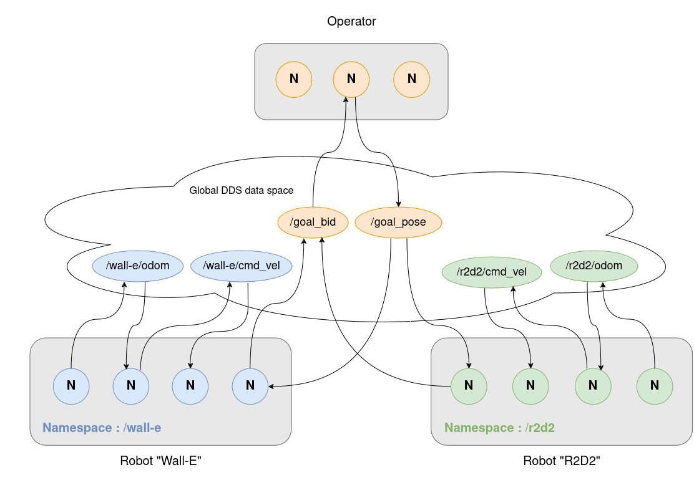
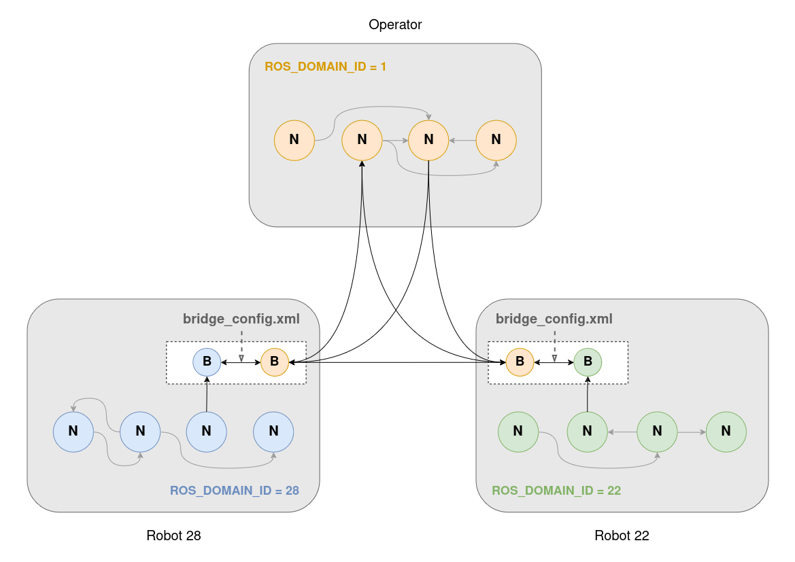
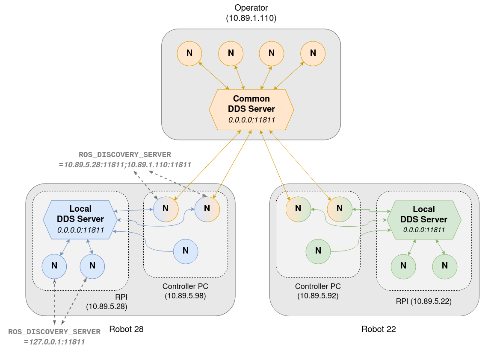
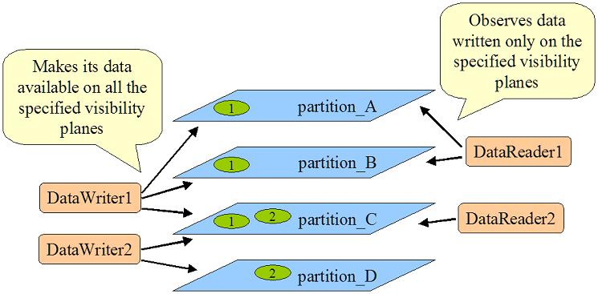
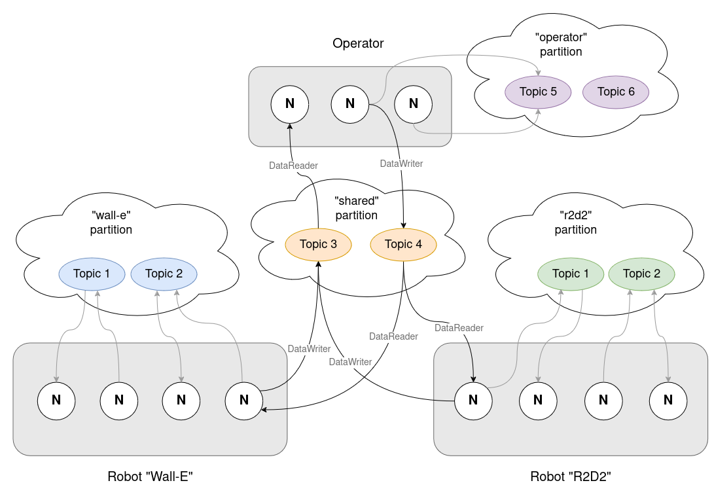
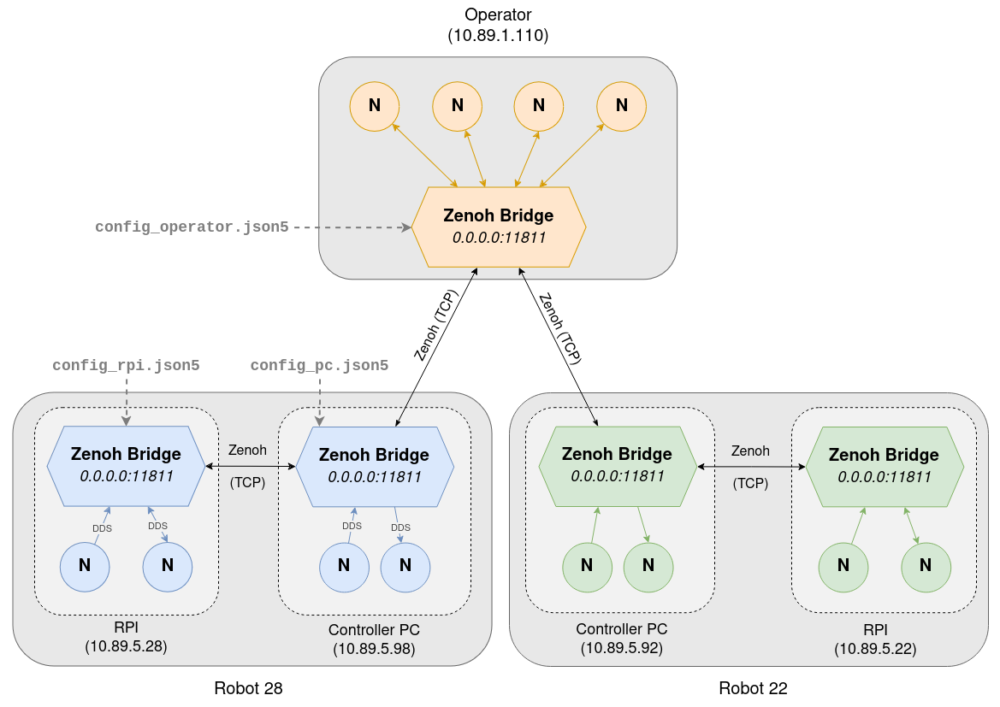

# Communication methods

Here is the list of the different communication methods that have been implemented in this repository :

- **Namespacing**
- **Different domain IDs**
- **DDS Discovery servers**
- **DDS Partitions**
- **Zenoh**

### Namespacing
> See working demos [here](./simulation.md#1-robot-separation-using-namespaces)

**Namespaces** are prefixes to node names, topics, actions and services. They allow to have multiple elements with the same name but different prefix. 

In a multi-robot scenario, namespacing is the easiest solution to separate each robot with a unique namespace, in order for robots
to not have name conflicts when running the same nodes and using the same topics.
> An example of this is to prefix the `/cmd_vel` topic for robots (`/wall-e/cmd_vel` and `/r2d2/cmd_vel`), to prevent them from having the same velocity command.

With our multi-robot architecture, we would have a configuration like the following :

### Different domain IDs
> See working demos [here](./simulation.md#2-multi-domain_id-communication)

ROS2 uses **DDS** (**D**ata **D**istribution **S**ervice) as the default middleware for communication. DDS allows nodes to 
discover other nodes that are on the same network. In order to create different logical networks, DDS provides a feature called 
the **domain ID**. Each node is allowed to communicate to nodes that are on the same ID, but can't communicate with nodes on other domain IDs.

In ROS2, the default domain ID is 0, but it can be configured using the `ROS_DOMAIN_ID` env variable (between 0 and 101 inclusive). The domain ID is then mapped to a UDP port, thus creating application isolation.

In a multi-robot scenario, assigning a different `ROS_DOMAIN_ID` to each robot allows to completely isolate them from the others. 
However, using the [domain_bridge](https://github.com/ros2/domain_bridge/blob/main/doc/design.md) library, we can create a bridge
between different domain IDs, and specify which topics should be broadcasted towards another domain ID (which would be shared between robots).

This library allows us to run multiple nodes in the same OS process, in order to share data and "bridge" topics/services/actions from one DOMAIN_ID to another one.

With our multi-robot architecture, we would have the following configuration :

### DDS Discovery servers
> See working demos [here](./simulation.md#3-network-isolation-with-fastdds-discovery-server)

As stated before, DDS is the protocol used by ROS2 for communicating between nodes. One aspect of this protocol is to look for
elements that a node can communicate with on the network. It's the "Discovery protocol". By default, the **Simple Discovery 
protocol** is used, which consists in sending multicast messages to every other node in the network.

Fast DDS, one of the DDS middlewares, provides a [Discovery server](https://docs.ros.org/en/iron/Tutorials/Advanced/Discovery-Server/Discovery-Server.html) to replace the **Simple Discovery protocol**. It works similarly to a router and
allows to isolate DDS subnets.
Each node can choose which DDS Discovery servers (it can be more than 1) it connects to using the `ROS_DISCOVERY_SERVER` env 
variable. Its main purpose is to reduce the network traffic induced by the discovery phase.

> Listener 1 discovers topics from Talker 1 & 2 but Listener 2 only discovers topics from Talker 1

A discovery server is described by :
- its **IP address**
- its **port**
- its **ID**

In our multi-robot scenario, we could use this Discovery server to isolate nodes running on the robot, by connecting them to a DDS
Discovery server running locally. Nodes that also need to communicate to other robots would connect to both their local DDS server
and either a global one or another robot's one.

With our multi-robot architecture, we would have the following configuration :

### DDS partitions
> See working demos [here](./simulation.md#4-robot-isolation-using-dds-partitions)

As stated before, DDS is the protocol used by ROS2 for communicating between nodes. DDS introduced the concept of
[**partitions**](https://docs.ros.org/en/iron/Tutorials/Advanced/FastDDS-Configuration.html#using-partitions-within-the-topic) :
each partition is defined by a name (**string**), and only elements that have a partition in common can communicate. 

Contrary to the DOMAIN_ID, nodes still receive the broadcast discovery messages (since they are on the same DOMAIN_ID they have
the same UDP port) but drop them if they don't have a partition in common.

Partitions can be applied to specific nodes, but also more precisely **publishers/subscribers** *(DataReaders/DataWriters in DDS 
terms)*. To configure this, you can create an **XML file** and apply it by setting the `FASTRTPS_DEFAULT_PROFILES_FILE=/path/to/file.xml` env variable.

In our multi-robot scenario, we could have **one partition for each robot** (`robot_X`). Topics that need to stay local would be 
published to that partition and topics that need to be shared across robots would be published in the `shared` partition.

With our multi-robot architecture, we would have the following configuration :

### Zenoh
> See working demos [here](./simulation.md#5-robot-isolation-with-domain-id-and-zenoh)

[Eclipse's Zenoh](https://zenoh.io/) is a communication protocol based on the Publish/Subscribe mechanism. It has grown in popularity as a potential replacement for DDS in ROS2, thanks to its reduced number of discovery messages.

Zenoh works by providing a Router, that centralizes the discovery information, and connects to other Routers across networks to share the information about publishers and subscribers it has access to. That way, Zenoh allows to reduce the discovery traffic, but standard direct TCP communication is used once communication is established.

This router can be configured (using a JSON file) to only allow certain publisher/subscriber discovery informations to be shared to other routers, and even choose through which network interface they should be available. That way, Zenoh provides a really powerful level of configuration to achieve isolation.

Zenoh provides 2 options to be integrated in ROS2 :
- `rmw_zenoh`
- `zenoh-bridge-ros2dds`

Both options provide very similar configuration options. As `rmw_zenoh` didn't provide binaries for the ARM architecture, running it on a Raspberry PI would have required to cross-compile it since it was taking too long on the Raspberry PI itself. For that reason, the `zenoh-bridge-ros2dds` will be studied in this paper, but the conclusions should be very similar for `rmw_zenoh`.

`zenoh-bridge-ros2dds` works by creating a node that listens to the DDS traffic on the local machine, translates the received discovery messages and then send them via the Zenoh Router. 

In a multi-robot scenario, one `zenoh-bridge-ros2dds` could be used for each physical computer. Publishers/Subscribers that should stay local would not be on the `allow` list in the configuration file, whereas those who need to be shared would be. The bridge could even be configured to restrict the network interfaces used to further configure the isolation.

With a multi-robot architecture, you would have the following configuration :

