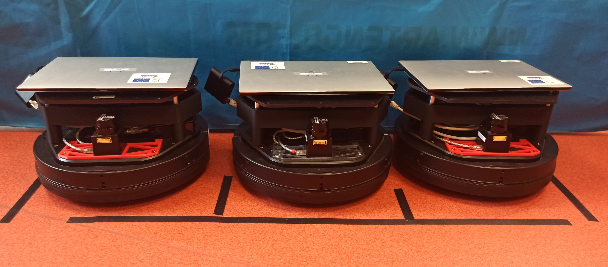

# Real robot demos

These are the commands to run the warehouse demo on real robots.

## Setup

<div align="center">
    
    
</div>


We are using 3 Kobuki robots, each with a Raspberry PI 3B mounted on top and running the drivers (for the motors and the 2D Lidar). Each robot is connected (either with a cable or trough the wifi network) to a controller PC (Dell XPS 13 7390) running the high level control (nav2, multi-robot communication etc.).

> [!NOTE]
> To run these demos, you'll have to clone the [mb6-space](https://github.com/imt-mobisyst/mb6-space) repository on the PIs, and checkout on the `multibot` branch

## Methods

### 1. Namespaces

> ⚠️ NOT WORKING

Pibot : Uncomment this line in the `mb6-space/bin/start-tbot.sh` file
```bash
ROS_DOMAIN_ID=99 ros2 launch multibot multibot.launch.py type:="namespace"
```

On the operator PC :
```bash
ros2 launch multibot warehouse_namespace_operator.py
```

On the Controller PCs :
```bash
ros2 launch multibot warehouse_namespace_launch.py robot_id:=22
ros2 launch multibot warehouse_namespace_launch.py robot_id:=23
ros2 launch multibot warehouse_namespace_launch.py robot_id:=24
```


### 2. Domain ID Bridge

Pibot : Uncomment this line in the `mb6-space/bin/start-tbot.sh` file
```bash
ros2 launch multibot multibot.launch.py type:="domain_id"
```

On the operator PC :
```bash
ros2 launch multibot warehouse_bridge_operator.py
```

On the Controller PCs :
```bash
ros2 launch multibot warehouse_bridge_launch.py robot_id:=22 operator_domain_id:=99
ros2 launch multibot warehouse_bridge_launch.py robot_id:=23 operator_domain_id:=99
ros2 launch multibot warehouse_bridge_launch.py robot_id:=24 operator_domain_id:=99
```


### 3. FastDDS Discovery servers
> ⚠️ NOT WORKING

Pibot : Uncomment this line in the `mb6-space/bin/start-tbot.sh` file
```bash
ROS_DOMAIN_ID=99 ros2 launch multibot multibot.launch.py type:="discovery"
```

On the operator PC :
```bash
ros2 launch multibot warehouse_dds_operator.py
```

On the Controller PCs :
```bash
ros2 launch multibot warehouse_dds_launch.py robot_id:=22 robot_ip:=10.89.5.22 subnet_dds_server:="10.89.5.90:11811"
ros2 launch multibot warehouse_dds_launch.py robot_id:=23 robot_ip:=10.89.5.23 subnet_dds_server:="10.89.5.90:11811"
ros2 launch multibot warehouse_dds_launch.py robot_id:=24 robot_ip:=10.89.5.24 subnet_dds_server:="10.89.5.90:11811"
```
> Note : `robot_ip` should be `192.168.1.1` when connected in ethernet


### 4. DDS partitions
> ⚠️ NOT WORKING

Pibot : Uncomment this line in the `mb6-space/bin/start-tbot.sh` file
```bash
ROS_DOMAIN_ID=99 ros2 launch multibot multibot.launch.py type:="partitions"
```

On the operator PC :
```bash
ros2 launch multibot warehouse_partition_operator.py
```

On the Controller PCs :
```bash
ros2 launch multibot warehouse_partition_launch.py robot_id:=22
ros2 launch multibot warehouse_partition_launch.py robot_id:=23
ros2 launch multibot warehouse_partition_launch.py robot_id:=24
```


### 5. Zenoh DDS Bridge

Uncomment the following line in the `mb6-space/bin/start-tbot.sh` file on the RPIs :
```bash
ros2 launch multibot multibot.launch.py type:="zenoh"
```

On the operator PC :
```bash
ros2 launch multibot warehouse_zenoh_operator.py
```

On the Controller PCs :
```bash
ros2 launch multibot warehouse_zenoh_launch.py robot_id:=22 robot_ip:=10.89.5.22 operator_ip:=10.89.5.90
ros2 launch multibot warehouse_zenoh_launch.py robot_id:=23 robot_ip:=10.89.5.23 operator_ip:=10.89.5.90
ros2 launch multibot warehouse_zenoh_launch.py robot_id:=24 robot_ip:=10.89.5.24 operator_ip:=10.89.5.90
```
> Note : `robot_ip` should be `192.168.1.1` when connected in ethernet
